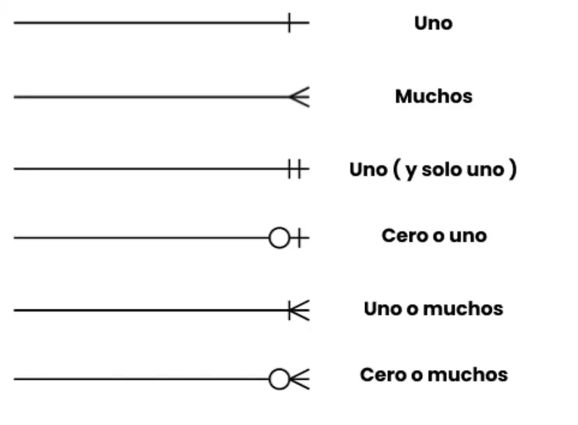
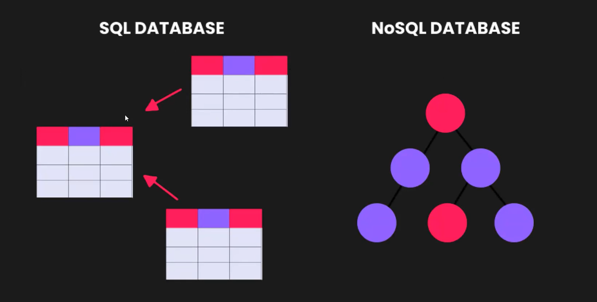

<div align="center">
    
</div> 

# Clase 01: Introducción a Base de datos

## Objetivos
Introducción al mundo de las base de datos.

## ¿ Qué es una base de datos ?
- 👉 Una **base de datos** es una colección organizada de información  estructurada que se almacena y se accede utilizando un sistema de gestión de bases de datos.
- 👉 Permite almacenar grandes volúmenes de datos de manera eficiento y proporcionan un acceso rápido y seguro a la información. 
- 👉 Consta de **datos**, un **sistema de gsetión de base de datos** (DBMS, por sus siglas en inglés) y **usuarios finales**.
- 👉 Los datos se pueden organziar en tablas o documentos y se relacionan entre sí mediante **claves** o **identificadores únicos**.

### Características
- 👉 **Estructura organizada**: Los datos en una base de datos se organizan em **estructuras lógicas**, como tablas, que facilitan la búsqueda y recuperación de información.
- 👉 **Acesso rápido**: Las base de datos permiten realizar consultas y búsquedas eficientes, lo que agiliza el acceso a la información requerida. 
- 👉 **Seguridad**: Las bases de datos proporcionan mecanismos para proteger la integridad y confidencialidad de datos, permitiendo restringir el acceso a usuarios autorizados.
- 👉 **Escabilidad**: Las bases de datos pueden crecer y adaptarse a medida que aumenta la cantidad de datos y usuarios.
- 👉 **Concurrencia**: Los sistemas de gestión de bases de datos pueden manejar múltiples usuarios accediendo a los datos simultáneamente, garantizando la consistencia y evitando conflictos. 

### Tipos de bases de datos
- 👉 **Base de datos relacionales**
    - Son las más comunes y utilizan el módelo relacional para organizar y almacenar los datos. 
    - Utilizan tablas con filas y columnas para representar entidades y relaciones. 
- 👉 **Base de datos no relacionales**
    - Estas mismas no utilizan el modelo relacional y se centran en la escalabilidad y la flexibildad.
    - Algunos tipos populares son: 
        - **Base de datos de documentos**: Almacenan datos en documentos JSON o similares. Por ejemplo Mongo que es BJSON.  
        - **Base de datos de grafos**: Almacenan datos en nodos y relaciones. Son útiles para analizar relaciones complejas. 
        - **Base de datos de clave-valor**: Almacenan datos como pares clave-valor. Son rápidas y eficientes para operaciones de lectura / escritura. 

## Estructura de una base de datos SQL
- 👉 **Tablas**: Las bases de datos SQL está compuestas por tablas que contienen filas y columnas para almacenar y organizar datos. 
- 👉 **Claves primarias**: Las tablas tienen claves primarias, que son identificadores únicos para cada registro en una tabla. 
- 👉 **Relaciones**: Las bases de datos en SQL permiten establecer relaciones entre tablas mediante claves foráneas, lo que facilita la asociación y consulta de datos relacionados. 
- 👉 **Claves foráneas**: Son restricciones utilizadas para establecer y mantener relaciones entre tablas en una base de datos relacional. Una clave foránea es un campo (o conhundo de campos) en una tabla que hace referencia a la clave primaria de otra tabla, estableciendo así una relación entre ellas. 

## Notación y símbolos de diagramas entidad-relación
- 👉 **Cardinalidad**: 
    - La cardinalidad en un diagrama ER indica cuántas instancias de una entidad pueden estar relacionadas con instancias de otra entidad en una relación específica. 
    - Se representa mediante símbolos como **1** (uno) o **N** (muchos).
    - Por ejemplo, una relación "1 a N" indica que una instancia de la entidad A puede estar relacionadas con varias instancias de la entidad B, pero una instancia de la entidad B solo puede estar relacionada con una instancia de la entidad A. 

    

    - **Uno**: indica que una instancia de una entidad está relacionada con exactamente una instancia de otra entidad en relación específica. Es una cardinalidad de uno a uno. 
    - **Muchos**: inidca que instancia de una entidad puede estar relacionada con varias instancias de otra entidad en la relación específica. Es una cardinalidad de uno a muchos. 
    - **Uno (y solo uno)**: indica que una instancia de una entidad está relacionada con exactamente una instancia de otra entidad en relación específica, y esta relación es obligatoria. No se permite la ausencia de la relación en ninguno de los lados. 
    - **Cero a uno**: Indica que una instancia de una entidad puede estar opcionalmente relacionada con una instancia de otroa entidad en la relación específica. Puede haber una relación  no haber ninguna relación. 
    - **Uno o muchos**: indica que una instancia de una entidad está relacionada con al menos una instancia, pero puede estar relacionada con varias instancias de otra entidad en la relación específica. Es similar a la cardinalidad de muchos, pero se enfatiza que debe haber al menos una relación. 
    - **Cero a muchos**: indica que una instancia de una entidad puede estar relacionada con ninguna, una o varias instancias de otra entidad en la relación específica. No hay una restricción sobre la cantidad de relaciones permitidas. 

- 👉 **Ordinalidad**:
    - La ordinalidad se refiere a la existencia obligatoria o no de una relación entre entidades. Se representa mediante símbolos como **O** (opcional) o **M** (obligatorio).
    - Por ejemplo, una relación "1 a 0" indica que una instancia de la entidad A puede estar relacionada opcionalmente con una instancia de la entidad B, mientras que una relación "1 a M" indica quue ina instancia de la entidad A debe estar relacionada obligatoriamente con una instancia de la entidad B.

- 👉 **Herramientas** para hacer diagramas: `https://lucid.app/` 

## Consultas SQL
👉 SQL proporciona comandos para realizar consultas, inserciones, actualizaciones y eliminaciones (CRUD) de datos en una base de datos. Por ejemplo: 

| Comando | Descripción | 
| ------- | ----------- | 
| **SELECT** | Para recuperar datos de una o varios tablas y cómo se pueden especificar condiciones y filtros | 
| **JOIN** | Para combinar datos de múltiples tablas basado en relaciones específicias | 
| **UPDATE** | Actualiza registros existentes |
| **DELETE** | Elimina registros | 


👉 Ejemplo: 

```sql
SELECT nombre, email
FROM usuarios
WHERE activo = 1
ORDER BY nombre ASC
LIMIT 10;
```

### Interfaces gráficas para base de datos SQL
- 👉 Existen diversas interfaces gráficas para interactuar con base de datos SQL, como: 
    - MySQL
    - Workbench
    - phpMyAdmin
    - Microsoft SQL Server Management Studio
- 👉 Estas herramientas proporcionan un entorno visual para administrar la estructura de la base de datos, realizar consultas, crear y modificar tablas, entre otras tareas. 

### Seguridad y mantenimiento
- 👉 Es importante establecer permisos y privilegios adecuados par garantizar la seguridad de los datos y prevenir accesos no autorizados. 
- 👉 También realizar copias de seguridad periódicas y tener mecanismos de recuperación en cas de fallas o errores en la base de datos. 

## Estructura de una base de datos NoSQL
- 👉 Es un término que engloba a una variedad de sistemas de bases de datos que difieren del módelo relacional tradicional. 
- 👉 Se diseñaron para manejar grandes volumnes de datos no estructurados, no relacionales o altamente variables, brindado escalabilidad y rendimiento. 
- 👉 Almacenan y recuperan datos en forma de documentos (generalmente en formato JSON o similar) en lugar de tablas. Por ejemplo: 
    - MongoDB
    - Couchbase
    - Firebase



- 👉 **Estructura flexible**: permite agregar, modificar y eliminar campos de manera dinámica, lo que las hace adecuadas para datos altamente variables o no estructurados. 
- 👉 **Consultas**: tiene su propio lenguaje de consulta. Algunos utilizan consultas basadas en documentos, mientras que otros utilizan consultas de estilo de grafos o consultas de clave-valor. 

## ¿ Qué es MongoDB ?
- 👉 Es un sistema de gestión de base de datos **NoSQL** orientado a documentos. Es una base de datos de código abierto y altamente escalable, diseñada para manejar grandes volumenes de datos no estructurados o semiestructurados. 
- 👉 **MongoDB** almacena los datos en documentos en formato BJSON (binary JSON), que es una representación binaria de documentos similares a JSON. Cada documento puede tener una estructura diferente, lo que proporciona flexibilidad para almacenar datos de manera más natural y sin la necesidad de seguir un esquema fijo.

### ¿ Dónde se usa ? 
- 👉 Es ampliamente utilizado en **aplicaciones web** y **móviles**, asi como en entorno de **big data** y **análisis de datos**.
- 👉 Su enfoque flexible y escalable lo hace adecuado para una amplia gama de casos de uso, desde pequeñas aplicaciones hasta grandes empresas con necesidades de almacenamiento y consultas de datos a gran escala.
- 👉 La elección depende de la estructura y requsitos de sus datos. MongoDB para datos flexibles y escalabes, MySQL (SQL) para datos estructurados y transacciones ACID. 
- 👉 Aplicaciones web con base de datos NoSQL (MongoDB):
    - **Redes sociales**: plataformas como Instagram utilizan mongoDB para almacenar datos de perfiles de usuarios, publicaciones y relaciones entre usuarios. 
    - **Aplicaciones de comercio electrónico**: algunas tiendas en línea utilizan MongoDB para gestionar catálogos de productos, datos de inventario y registro de transacciones.
    - **Aplicaciones de juegos**: juegos en línea como Candy Crush utilizan MongoDB para almacenar el progreso del jugador, puntuaciones y registro de juegos. 
- 👉 Aplicaciones web con base de datos MySQL:
    - **Sistemas de gestión de contenidos** (CMS): plataformas como WordPress utiilzan MySQL para almacenar y gestionar contenido, como publicaciones de blog, páginas y comentarios.
    - **Sistemas de reservas y citas**: aplicaciones como OpenTable o sistemas de reservas de hoteles utilizan MySQL para almacenar y gestionar datos de disponibilidad, reservas y clientes. 
    - **Aplicaciones de gestión de inventario**: sisemas de inventario para tiendas o almacenes utilizan MySQL para gestionar información sobre disponibilidad, reservas y clientes.

#### Transacciones ACID
- 👉 Es una unidad de trabajo lógica que se ejecuta en una base datos y cumple con las propiedades ACID: 
    - **A**: Atomicidad
        - Siginifica que se ejecuta como una unidad **indivisible**. Si una parte de la transacción falla, se desahacen todas las operaciones realizadas hasta ese punto, asegurando que los datos se mantengan en un estado coherente.
    - **C**: Consistencia
        - Una transacción debe llevar la base de datos de un estado válido o otro estado válido. Esto implica que todas las reglas y restricciones de integridad de los datos se mantienen antes y después de la transacción.
    - **I**: Aislamiento
        - Las transacciones deben ejecutarse de manera aislada, como si estuvieran ocurriendo de forma independiente. Esto significa que los cambios realizados por una transacción no deben ser visibles para otras transacciones hasta que se confirmen, evitando interferencias y conflictos entre transacciones concurrentes. 
    - **D**: Durabilidad
        -  Una vez que una transacción se ha confirmado (commit), sus cambios se vuelven permanentes y se mantendrán incluso en caso de fallos del sistema, como caídas de energía o reinicios. Los datos actualizados deben persistir en la base de datos. 
- 👉 Estas propiedades aseguran la integridad de los datos y la consistencia de las operaciones en un entorno de base de datos.
- 👉 Las transacciones **ACID** garantizan la integridad y confiabilidad de los datos en una base de datos, permitiendo que múltiples operaciones se agrupen como una unidad coherente y asegurando que se realicen correctamente incluso en situaciones adversas. 


## SQL vs NoSQL

| SQL | NoSQL |
| --- | ------ |
| Basado en un módelo relacional | No utiliza módelo relacional |
| Utiliza tablas y relaciones entre ellas | Puede manejar datos no estructurados o semiestructurados | 
| Esquema fijo y definido de antemano | Esquema flexible y sin restricciones fijas |
| Transacciones ACID para garantizar la integridad de los datos | Escalabilidad horizontal para manejar grandes volúmnes de datos |
| Idela para aplicaciones con datos estructurados y relaciones complejas | Alta velocidad de lectura / escritura |

- 👉 La elección entre **SQL** y **NoSQL** depende de las caracteristicas de los datos y las necesidades específicas de la aplicación.
- 👉 **SQL** es adecuado para datos estructurados y relaciones complejas, mientras que **NoSQL** es más flexible y escalable para datos no estructurados o cambiantes. 