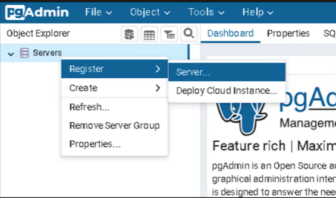

<div align="center">
    
</div> 

# Clase 02: Bases de datos relacionales I 

## Objetivos
- Introducción a SQL
- Docker
- Fundamentos de Docker
- pgAdmin
- Consultas SQL

👉 Levantar un servidor de **PostreSQL** con DOcker y utilizar la interfaz gráfica de **pgAdmin** para administrar visualmente la base de datos. 

## Tipos de bases de datos
- 👉 **Base de datos relacionales**
    - Son las más comunes y utilizan el módelo relacional para organizar y almacenar los datos. 
    - Utilizan tablas con filas y columnas para representar entidades y relaciones. 

## Estructura de una base de datos SQL
- 👉 **Tablas**: Las bases de datos SQL está compuestas por tablas que contienen filas y columnas para almacenar y organizar datos. 
- 👉 **Claves primarias**: Las tablas tienen claves primarias, que son identificadores únicos para cada registro en una tabla. 
- 👉 **Relaciones**: Las bases de datos en SQL permiten establecer relaciones entre tablas mediante claves foráneas, lo que facilita la asociación y consulta de datos relacionados. 
- 👉 **Claves foráneas**: Son restricciones utilizadas para establecer y mantener relaciones entre tablas en una base de datos relacional. Una clave foránea es un campo (o conjundo de campos) en una tabla que hace referencia a la clave primaria de otra tabla, estableciendo así una relación entre ellas. 

## ¿ Qué es Docker ? 
- 👉 Docker es una herramienta que nos permite crea, gestionar y ejecturar contenedores. 
- 👉 Los contenedores son entornos ligeros y portátiles que encapsulan aplicaciones y todas sus dependencias, garantizando la consistencia en diferentes entornos. 

### Docker Desktop
- 👉 Está interfaz gráfica nos permite ver todos los contenedores que tenemos y levanta una máquina virutal para ejecutar los archivos en ellos. 
- 👉 Descarga en: `https://www.docker.com`

### Docker compose
- 👉 Para levantar tanto la base de datos como pgAdmin, utilizaremos Docker Compose
- 👉 Nos permite definir y gestionar múltiples contenedores e imágenes en un solo archivo. 
- 👉 El primer paso es crear el archivo `docker-compose.yml`. En este archivo definimos qué servicios queremos levantar, cómo se configuran y qué imágenes utilizar. 
- 👉 Podes encontrar ejemplos y documentación sobre la sintaxis: `https://docs.docker.com/reference/compose-file/version-and-name/`

### Imágenes en Docker
- 👉 Son plantillas o modelos desde los cuales se crean los contenedores. 
- 👉 Cada imágen contiene un sistema de archivos completo con todo lo necesario para ejecutar una aplicación: el código, las bibliotecas, las dependencias y cualquier otra cosa requerida. 

#### Levantando las imágenes
- 👉 Una vez creado el archivo, podemos levantar las imágenes con el comando `docker-compose up`.
- 👉 Esto descargará y ejecutará las imágenes necesarias si aún no estás disponibles en nuestra PC. 

#### Versión
- 👉 Última versión de docker: `https://docs.docker.com/compose/releases/release-notes/`
- 👉 Si querés chequear la versión instalada en tu sistema, podés correr:
```bash
docker compose version
```
- Para informaión de los services: `https://hub.docker.com/`

## ¿ Qué es pgAdmin ?
- 👉 Es una herramienta de administración y desarrollo de código abierto diseñada para trabajar con **PostgreSQL**, un potente sistema de gestión de bases de datos relacional. 
- 👉 Proporciona una interfaz gráfica intuitiva y fácil de usuar que facilita la administración de base de datos PosgreSQL y permite realizar tareas comunes de manera eficiente.
- 👉 Cuando todo esté listo, podemos acceder a la interfaz de pgAdmin en nuestro navegador ingresando a `localhost:80`. Nos logueamos con la configuración por defecto que establecimos en el docker-compose.



### Consultas en pgAdmin
- 👉 Una vez dentro, podemos comenzar a enviar consultas a la base de datos usando la herramienta de consultas de pgAdmin.

#### Create Table
- 👉 Es una sentencia SQL utilizada para crear una nueva tabla en base de datos. En el ejemplo proporcionando, estamos creando una tabla llamada "camadas" con tres columnas: 
    - id
    - nombre
    - días 
- 👉 La columna "**id** es una clave primaria autoincremental, miestras que las columnas "**nombre**"y "**dias**" son de tipo varchar y almacenarán texto. 

```sql
CREATE TABLE camadas (
    id serial not null primary key,
    nombre varchar(5),
    dias varchar(255)
)
```

#### Select * From
- 👉 Es una sentencia SQL utilizada para recuperar datos de una tabla o vista en una base de datos. La clásula **FROM** especifica ;a tabla desde la cuál se extraerán los datos. 
- 👉 En el ejemplo, estamos seleccionando todos los registros de la tabla "camadas" y mostrándolos en el resultado.

```sql
SELECT * FROM camadas;
```

#### Insert into
- 👉 Es una sentencia SQL utilizada para insertar nuevos registros en una tabla. 
- 👉 En el ejemplo, estamos insertando un nuevo registro en la tabla "camadas" coo valores especifícos para las columnas "nombre" y "dias".
- 👉 La cláusula **VALUES** se utiliza junto con **INSERT INTO** para especificar los valores que se inserterán en las columnas de la tabla. 
- 👉 En el ejemplo, estamos insertando el valor "2717" en la columna de "nombre" y el valor de "Martes y Jueves" en la columna "días". 

```sql
INSERT INTO camadas(nombre, dias)
VALUES(2717, "Martes y Jueves");
```

### Conclusión
- 👉 **Create table**: Crea una nueva tabla en la base de datos con columnas y tipos de datos especificados.
- 👉 **Select * from**: Recupera todos los registros de una tabla especifica.
- 👉 **Insert into**: Inserta nuevos registro en una tabla especifica. 
- 👉 **Values**: Especifica los valores que se insertarán en la columnas de la tabla en una sentencia `insert into`