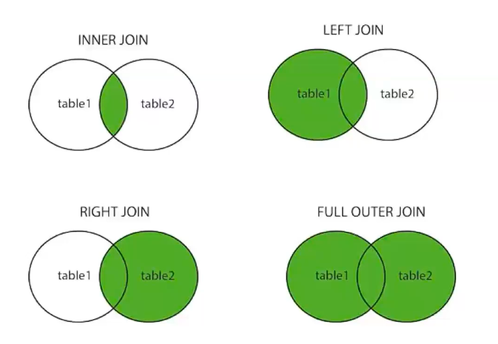

<div align="center">
    
</div> 

# Clase 04: Bases de datos relacionales III

## Objetivos
Entender y realizar nuestros primeros JOINS en SQL

## ¿ Qué es un JOIN ? 
- 👉 Los **JOINS** son una poderosa herramienta en SQL que nos permiten combinar datos de múltiples tablas en una sola consulta. 
- 👉 Son esenciales para realizar consultas complejas y obtener información relevante de diferentes fuentes de datos. 

### Tipos de JOINs
- 👉 Existen varios tipos de **JOINs** en SQL, cada uno con su propio propósito y uso.
    - **INNER JOIN**: combina registros que tienen coincidencias en ambas tablas.
        - Sintaxis básica: `SELECT columna(s) FROM tabla1 INNER JOIN tabla2 ON tabla1.columna = tabla2.columna`
    - **LEFT JOIN**: combina todos los registros de la primera tabla con los registros coincidentes de la segunda tabla.
        - Sintaxis básica: `SELECT columna(s) FROM tabla1 LEFT JOIN tabla2 ON tabla1.columna = tabla2.columna`
    - **RIGHT JOIN**: Similar al LEFT JOIN, pero combina todos los registros de la segunda tabla con los registros coincidentes de la primera tabla.
        - Sintaxis básica: `SELECT columna(s) FROM tabla1 RIGHT JOIN tabla2 ON tabla1.columna = tabla2.columna`
    - **FULL JOIN**: combina todos los registros de ambas tablas, mostrando **NULL** en los lugares donde no hay coincidencias. 
        - Sintaxis básica: `SELECT columna(s) FROM tabla1 FULL JOIN tabla2 ON tabla1.columna = tabla2.columna`

    

## Consultas
👉 Crear tabla camada
```sql
    CREATE TABLE camada(
        id      serial          not null    primary key,
        nombre  int             not null    unique,
        dias    varchar(150)    not null,
        modulo  varchar(100)    not null, 
    )
```

👉 Crear tabla alumno relacionada con camada
```sql
    CREATE TABLE alumno(
        id          serial          not null    primary key,
        nombre      varchar(255)    not null,
        mail        varchar(150)    not null,
        edad        int             not null,
        camada      int,
        foreign key (camada) references camada(nombre)
    )
```

👉 Agregar datos en una sola query
```sql
    INSERT INTO camada (nombre, dias, modulo)
    VALUES
        (2717, 'Martes y jueves', 'Backend')
        (2817, 'Lunes y miércoles', 'React')
        (2617, 'Lunes y miércoles', 'Backend')
        (3217, 'Martes y jueves', 'JavaScript')
```

👉 Apodos a las tablas
```sql
    SELECT a.id, a.nombre FROM alumno a
    SELECT a.id, a.nombre FROM alumno as a
```

👉 Unir todos los alumnos y mostrar la información de camadas, si no tienen camadas muestra null
```sql
    SELECT a.id, a.nombre, c.nombre, c.dias, c.modulo FROM alumno a
    LEFT JOIN camada c
    ON a.camada = c.nombre
```

👉 Muestra la información de las camadas, si no tiene alumnos muestra null
```sql
    SELECT a.id, a.nombre, c.nombre, c.dias, c.modulo FROM alumno a
    RIGHT JOIN camada c
    ON a.camada = c.nombre
```

👉 Coincida en las dos tabla (no muestra valores null)
```sql
    SELECT a.id, a.nombre, c.nombre, c.dias, c.modulo FROM alumno a
    INNER JOIN camada c
    ON a.camada = c.nombre
```

👉 Muestra todos los alumnas y camadas aunque el alumno no tenga camada, o la camada no tenga alumno
```sql
    SELECT a.id, a.nombre, c.nombre, c.dias, c.modulo FROM alumno a
    FULL JOIN camada c
    ON a.camada = c.nombre
```

👉 Cuenta las cantidad de camadas segun el dia
```sql
    SELECT dias, count(dias) FROM camada
    group by dias
```

👉 Cuenta las cantidad de alumnos en las camadas según el dia, aunque no tenga alumnos
```sql
    SELECT c.dias, count(c.dias) FROM camada c
    LEFT JOIN alumno a
    ON a.camada = c.nombre
    group by c.dias
```

👉 Cuenta las cantidad de alumnos en las camadas según la camada, aunque no tenga alumnos
```sql
    SELECT c.nombre, count(c.nombre) FROM camada c
    LEFT JOIN alumno a
    ON a.camada = c.nombre
    group by c.nombre
```